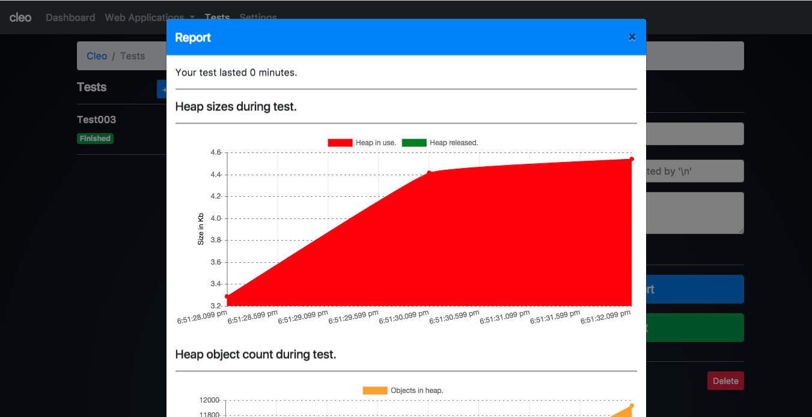
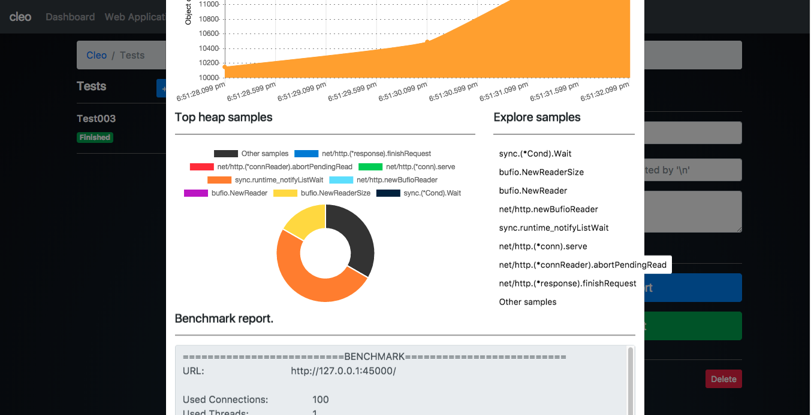
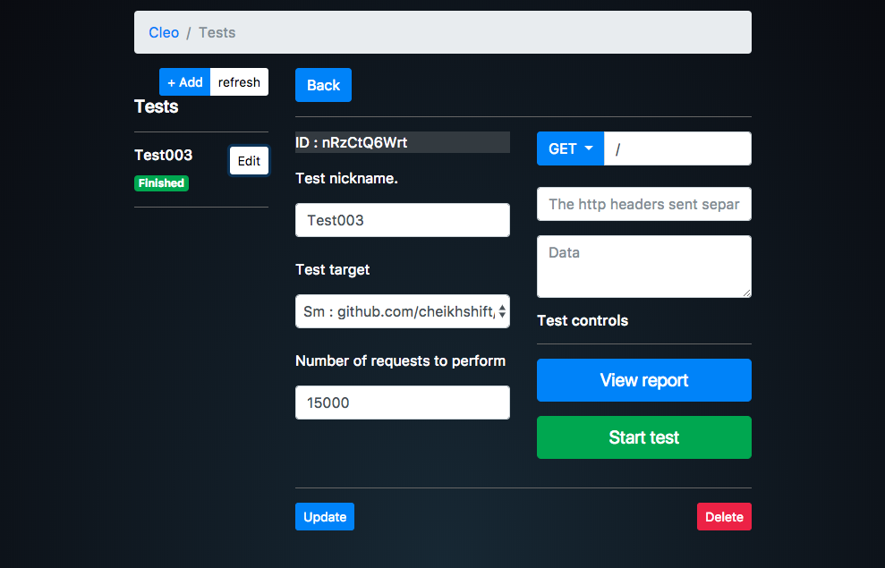
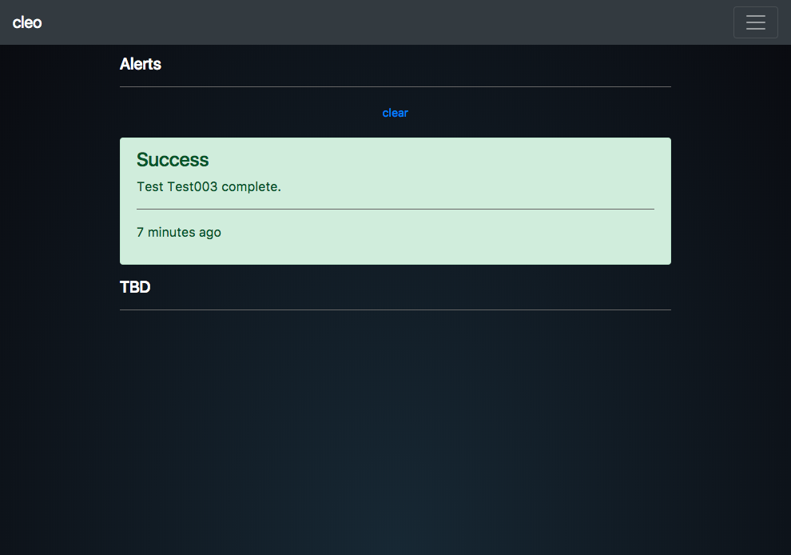
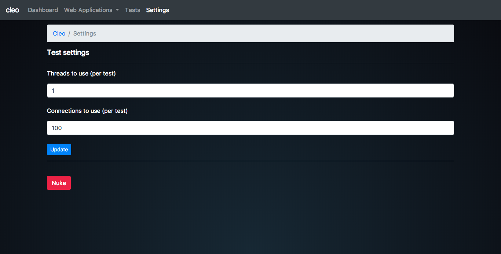
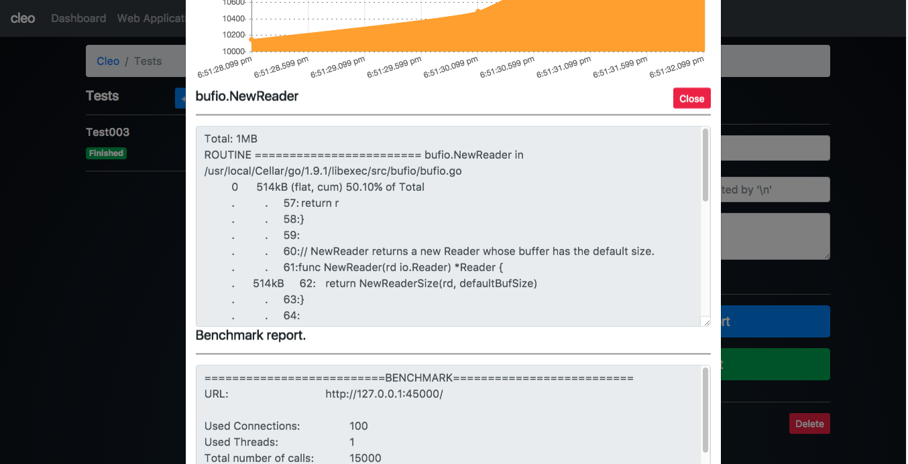

# Cleo
A web application used to analyze other web applications written in Go. It generates LARs (long-ass reports) of tests performed.

## Requirements
1. Go lang
2. go-work : install with `go get github.com/adjust/go-wrk`
3. $GOPATH set. Guide [here](https://learn-golang.com/en/getting-started/)
4. Unix/Linux OS.

## Launch
Run the following command to launch application :
		$ cleo

## Projects used 
1. Twitter bootstrap beta 4.0.0-beta.2
2. Angular JS 1.5.6
3. Momentum 
4. GopherSauce
5. Chart.js

### Screenshots

