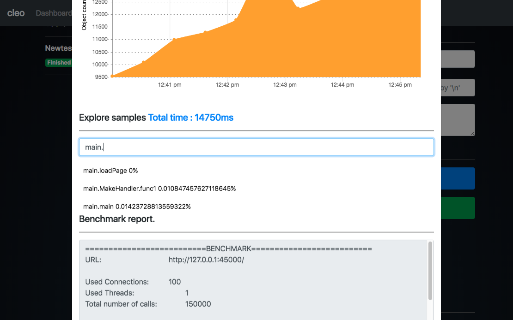
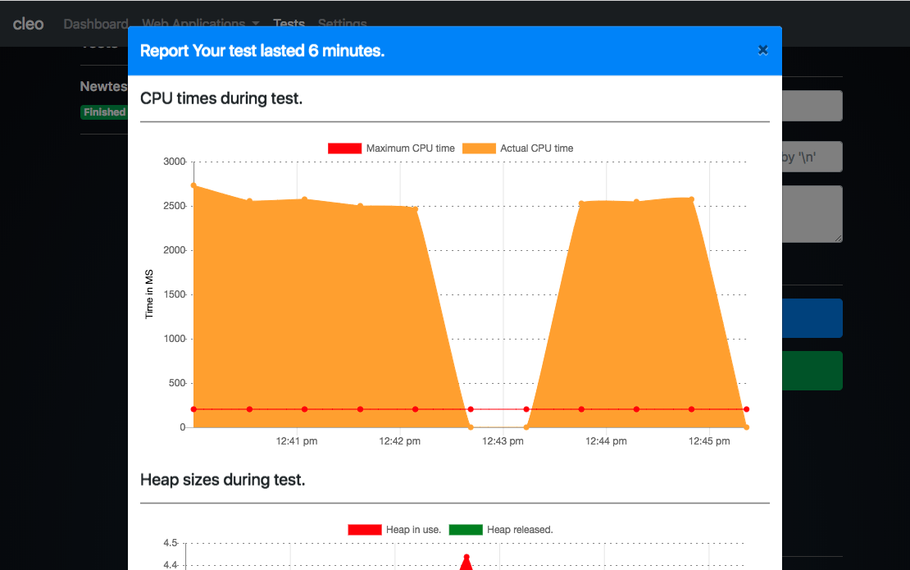
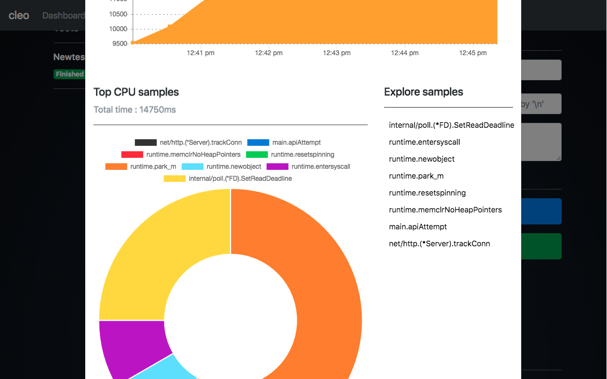

# Cleo
A web application used to analyze other web applications written in Go. It generates LARs (long-ass reports) of tests performed.

### Updates :
- Inspect CPU times.
- Test applications built and deployed at external locations. This application must have `pprof` handlers available.

## Requirements
1. Go lang
2. go-work : install with `go get github.com/adjust/go-wrk`
3. $GOPATH set. Guide [here](https://learn-golang.com/en/getting-started/)
4. Unix/Linux OS.

## Install
Install with :
		
		$ go get github.com/cheikhshift/cleo

## Launch
Run the following command to launch application :
		
		$ cleo

## Go project setup
You Go web application should retrieve the port number to listen on from env. variable $PORT.

Example
	
	...
	port := ":defaultport"
	if envport := os.ExpandEnv("$PORT"); envport != "" {
		port = fmt.Sprintf(":%s", envport)
	}
	...
	log.Fatal(http.ListenAndServe(port, nil) )

## Projects used 
1. Twitter bootstrap beta 4.0.0-beta.2
2. Angular JS 1.5.6
3. Momentum 
4. GopherSauce
5. Chart.js

### Screenshots

